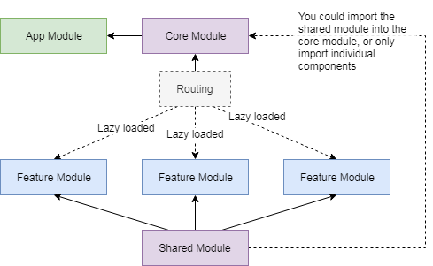

# Angular App Best Practices

This repo highlights common best practices, tips, possible solutions and personal opinions on many topics related to building frontend web apps. A lot of the topics could be related to any frontend framework, but we do focus on Angular.

## General Best Practices

1. __Keep the code simple__
    * Limit functions to 30'ish or fewer lines
    * Keep classes / files small. If your class has hundreads of lines, split it into 2 or more classes _(I would recommend using composition over inheritance)_
2. __Follow the [DRY principle](https://en.wikipedia.org/wiki/Don%27t_repeat_yourself)__
2. __Follow the [Single responsibility principle](https://en.wikipedia.org/wiki/Single_responsibility_principle)__
2. __Avoid deep indentation__
2. __Comments should explain WHY, not WHAT__
    * Comments should explain WHY you are doing something, not WHAT you are doing. Reading the code will explain the WHAT you are doing.

    ```javascript
    // BAD
    // set uid to id
    if (!myData.uid) myData.uid = myData.id;

    // BETTER
    // legacy data structure used id, now we use uid
    if (!myData.uid) myData.uid = myData.id;
    ```
6. __Limit line character length__
    * Limit line length to __80__ characters where possible
7. __Modularize your code__
    * Most of the time you will have a team of developers working on a project. If you modularize your code, it makes it easier for members to work on certain parts of the code / app with minimal conflicts when it comes time to merge.
    * If you follow the application structure below, it will help in keeping your code modular.
8. __Use composition over inhertiance__
    * Where possible, try and use composition instead of inheritance.
    * There are multiple ways to accomplish this with Javascript / Typescript. One way is to just add properties on a class that are set to other classes, [example found here](src/app/core/models/user/user.model.ts). Another way is to use a mixin style, [example found here](src/app/core/models/maths/maths.model.ts).
9. __Code splitting__
    * You should use code splitting when you application is quite large.
    * If you use the application structure detailed below, you can split the code using Angular lazy loaded routes. View the diagram below in the Application Structure.


## Application Structure

Most of the time, your app will grow to a medium to large size application. It's best to have a structure that is easy to understand and flexible enough to keep growing. A good way to accomplish this is to separate your code into different modules. Its recommended to have 1 core module, 1 shared module and many feature modules. View this repo which is based on this structure. Below is a description of each:

#### Core Module:

* The Core Module is only imported into the App Module
* Located at _/src/app/core_
* All your singleton services used throughout the app are located here. However, you do not need to provide them into the module, you can use the ``providedIn: 'root'`` functionality on the service (Angular 6+).
* Single instance components can go in the Core Module, such as, the main header that is used in the app.component.html file.
* Top level routing
* The Core Module can also contain: app-wide constants, decorators, app-wide models.

#### Shared Module:

* Common components, pipes, directives that will be used throughout your app
* Can also import and export other third party modules used throughout your app, such as the FormsModule or modules from PrimeNg and so on.
* Do not import the shared module into your App Module (or Core Module ??)
* No app-wide singleton services should be in the Shared Module, they go in the Core Module

#### Feature Modules:

* Different features that make up the application
* Feature Modules can be large sub-sections of the app containing their own components, routing, pages, services, models and so on.
* Feature Modules should be lazy loaded via routing

#### Module architecture diagram:



### FAQ's about module structure

#### What happens if I have a component in the Shared module that I want to use in the Core module? For example, I want to use the [button](src/app/shared/components/ui/button/button.component.ts) component inside the [header](src/app/core/components/header/header.component.ts) component.

Simply import the Shared module into the Core module. The Angular compiler will only include the app-button component into the main.js dist file, it will not include the [large-size](src/app/shared/components/large-size/large-size.component.ts) component into the main.js dist file. To test this out, you can simple do a build of this project ``npm run build`` and check the size of the main.js file. Then, add the ``<app-large-size></app-large-size>`` tag into the [header](src/app/core/components/header/header.component.ts) component and do another build. You should notice the main.js file being larger, around 60kb, as this is the size of the large-size component.

## Shorten & improve import statements

#### _Best practice one:_

Inside your tsconfig.json file, add the paths property:

```javascript
{
  "compilerOptions": {
    "baseUrl": "./",
    ...
    "paths": {
      "@core/*": ["src/app/core/*"],
      "@shared/*": ["src/app/shared/*"],
      "@features/*": ["src/app/features/*"]
    }
  }
}
```

Now you can import like:

```typescript
import { CoreModule } from '@core/core.module';
import { isSet } from '@core/utilities';
import { DatePickerComponent } from '@shared/components/date-picker';

// IMPORTANT: you can not do this, you must specify a /sometext
import { CoreModule } from '@core';
```

#### _Best practice two:_

Use an index.ts file to export all code. For example, in [/src/app/core/services/index.ts](src/app/core/services/index.ts) we export all services. This allows us to write import statements like: 

```typescript
import { WebWorkerService } from '@core/services';
```

## Styling & Scss

#### Best Practices:

* Each component should have its own style file, use this to style the component
* Place all global styles into _/src/styles_. Update your [angular.json](angular.json) file to add a __stylePreprocessorOptions__ option. This allows you to do short import statements, like: ``@import "variables";``
* Use scss variables. Create a [_variables.scss](src/styles/_variables.scss) in the _/src/styles/_ directory. Place all variables in here. You can now import them in any file like: ``@import "variables";``
* Use a size base value variable, like the one in the [_variables.scss](src/styles/_variables.scss) file. This is used for all your spacing and structure styling.

## Handling Events

There are many ways to handle events, some of the topics below are not really best practices but more personal opinion.

### App wide events / Global event hub

Sometimes you may need your app to have a global app wide event hub. One way to accomplish this is to use a [global events service](src/app/core/services/global-events.service.ts), this service uses a pub/sub events manager: [EventManager](https://github.com/nathan-andosen/event-manager). You can see in the [header component](src/app/core/components/header/header.component.ts) an example of emitting an event. You can see in the [home component](src/app/features/home/home-page.component.ts) an example of listening to an event (this uses a decorator, which automatically subscribes and unsubscribes for us).

### Component to Component - or - Service to Service communication

Sometimes you may want two or more components to communicate with each other (not parent / child components). To handle this, we can simple use a service that is used to emit events and both components can listen to these events. There is a couple of ways you can add events to your service, look at the [auth service](src/app/core/services/auth.service.ts) for examples.

### Parent & Child component communication

Parent components should pass data to child components via attributes. Child components should fire events up to parent components. This is a common best practice. However, if for any reason this does not meet your requirements, you could use a service (as mentioned above) to handle the communication.

## Building better components

Some good practices to follow when building components:

1. Try to avoid having many dependencies injected into your component. It makes it harder to test when you have a lot of dependencies.
1. Try to avoid adding business logic directly into the component. Instead, create a service for the component and inject the service into your component.
1. Every component should have a seperate file for html, scss and typescript. Unless the component is really small and has no styling, you could place it in the one typescript file.
1. Dont let your component grow too large or complex. Split the component into smaller components if it does get too large.
1. If you want a component to be reusable, make it a dumb component _(detailed below in the Smart vs Dumb section)_

### Structure for a complex component

Sometimes you will create a complex component that may contain its own services and other components, an example can be found in the [user create component](src/app/shared/components/user-create/user-create.component.ts). Try to follow these helpful practices:

* Interal components go into a folder called _components_. Internal services go into a folder called _services_. Same can be done for things like pipes, directives and so on.
* Use a [facade](src/app/shared/components/user-create/user-create.facade.ts) to expose any api or functionality outside of the component.
* All external services that you need to use in your component should be injected into your internal [service](src/app/shared/components/user-create/services/user-create.service.ts). Now you only need to inject the one service into your components, instead of having multiple dependencies, making it easier to maintain and test. In out example here, we use the AuthService which gets inject into out UserCreateService, then we use the UserCreateService in our internal components.
* Styling for components should be in the component, not a global style sheet

### Smart vs Dumb components

__Dumb components:__

* Presentaional only, used to display data
* Delegate user interaction up to smart components via events
* Data is normally passed to dumb components via attributes
* Great for re-uasability

__Smart Components:__

* Will contain business logic, not directly, this should be done in a service, and the smart component will use this service.
* Will probably have a service associated with it, for all its business logic
* Pass data to dumb components
* React to events from dumb components
* Are top level routable components (pages)

## Building better models

Check out the [User Model](src/app/core/models/user/user.model.ts) for some helpful examples on how you might accomplish some good practices like: reactive state management, single responsibility & composition and event handling.

#### Helpful tips

* __State management__
  * Your model will most likely have some type of state / data. For example, a user model may have a name, address and preferences as its data.
  * Making this state reactive is a good practice
  * You could use something like [ngrx](https://ngrx.io/) to handle state management, however, this may be overkill in many cases as its a large and complex library
  * We could just use RxJs to handle a reactive state / store. Something like: [ObservableStore](src/app/core/models/observable-store.model.ts)
  * Check out the [User Model](src/app/core/models/user/user.model.ts) for a good example. You can see how it is used reactively in the [User Creation Component](src/app/features/home/components/user-creation/user-creation.component.html)
* __Single responsibility__
  * A lot of the time your class model object will grow quite large and have a lot of different functionality
  * It is a good practice to split the model into smaller classes that handle a particular functionality
  * Check out the [User Model](src/app/core/models/user/user.model.ts) for a good example. In this example, we would assume the User model has a lot more functionality, so we split the address functionality into its own class as well as the user settings. The we use a form of composition to combine all the functionality back into the [User Model](src/app/core/models/user/user.model.ts).
  * You can see how we use this [User Model](src/app/core/models/user/user.model.ts) in the [User Creation Component](src/app/features/home/components/user-creation/user-creation.component.ts). We can now access the address functionality of a user by writing: ``user.address.someMethod()``.
* __Events__
  * Even know your model has reactive state, you might still have a need for events to be emitted from your model
  * One way to accomplish this is to use the [EventManager](https://github.com/nathan-andosen/event-manager) library as stated above in the _Handling Events_ section
  * Check out the [User Model](src/app/core/models/user/user.model.ts) for a good example. Now we can listen to events from a user like: ``user.events.on('some-event', (data) => {})``

## One build, deploy to many environments

_This is not a best practice, more of a personal opinion._

The default Angular setup wants you to do a different build for each different environment. I dont feel this is ideal, instead, I like to do one build that can be deployed to many environments. Below details how this is accomplished:

* We now have an [app-config.json](src/app/assets/app-config.json) file in our assets directory. This file is replaced / different per environment. So as part of your deployment process, you can replace this file with the correct config for the environment you are deploying too.
* You will see in the [environments](src/app/environments) folder, we have changed the environment class.
* The [main.ts](src/app/main.ts) file now loads differently. It first must fetch the app-config.json file before bootstrapping the Angular app.
* You can see an example in the [home component](src/app/features/home/home-page.component.ts) on how to get access to the config.

## Performance tips

_Todo_

* https://angular-guru.com/blog/angular-performance-tips

## Testing

_Todo_